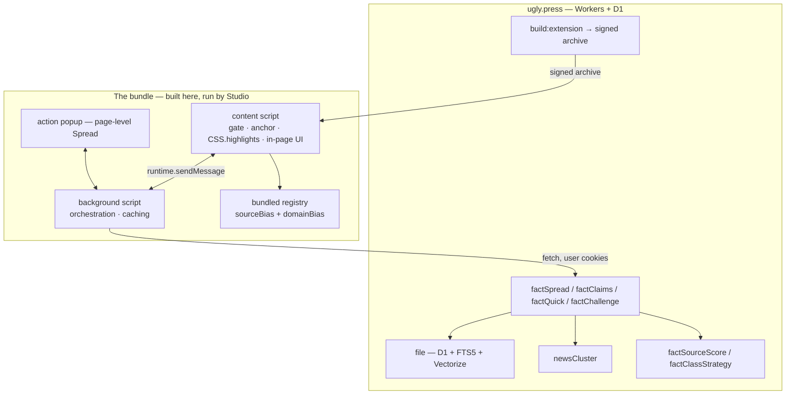

# The Ugly Fact Checker — design

**Date:** 2026-07-27
**Status:** Draft, approved for planning
**Repo:** `ugly-news` — builds, signs and serves the bundle; owns all rating logic
**Delivered by:** the Ugly Extension Runtime —
`ugly-studio/docs/superpowers/specs/2026-07-27-ugly-extension-runtime-design.md`
**Mocks:** [desktop](2026-07-27-fact-checker-mock.html) ·
[mobile](2026-07-27-fact-checker-mobile-mock.html)

---

## 1. What this is

A fact checker that runs on the live page — the real site, with its own layout,
ads and navigation intact. It highlights factual claims green / yellow / red,
backs each with an auditable tally of what rated sources actually said, and
offers a deeper adversarial **Challenge** on demand.

It ships as an **Ugly Extension**: an MV3-shaped bundle that ugly-news builds,
signs and serves. Studio hosts it and knows nothing about fact-checking. That
split means ratings, prompts, the source registry and the UI all update without
a Studio release, and the same bundle runs on desktop, Android and iOS.

Before any of that, it decides **whether the page is its business at all** (§3).
On a shoe listing it stays dormant and says so.

It is not an oracle. Every number it shows is a tally over named sources with
published reliability ratings, and the provenance of that tally is always on
screen.

### Why this is mostly wiring

| Need | Exists as |
|---|---|
| Multi-source evidence, pre-weighted by reliability | `file` collection — D1 + FTS5 + Vectorize 512-dim |
| Which outlets are reliable, and how biased | `shared/news/sourceBias.ts` (68 curated) + `domainBias` (~3,875 IDIAP rows) |
| Story-level coverage, blindspot, neutral summary | `newsCluster` + `clusterSynthesize` |
| Clustering maths, already TDD'd | `shared/news/cluster-logic.ts` |
| Fallback web retrieval | `WebRetriever` / Kagi via `ugly-app/search/server` |
| Injection, `chrome.*`, action UI on three platforms | the Extension Runtime |

### Non-goals

- **No fact-check knowledge in Studio.** If a Studio file names a claim, source
  or bias, the split has failed.
- **No DOM mutation of the guest page.** Highlights are painted with the CSS
  Custom Highlight API over live `Range`s.
- **Not a shopping, review, or ad-copy checker** (§3.2).
- **No user-tunable truth.** Whitelists filter *evidence*, never verdicts, and
  doing so is loudly indicated (§7).

### What it needs from the runtime

A slice of Tier A only: `runtime.sendMessage`, `storage.local`, `tabs.create`,
and the action badge and popup. A deliberately modest first consumer.

---

## 2. Architecture



### Auth and billing — no new flow

The background script calls ugly.press with the session's own cookies. Studio's
guest partition is already signed in to the fleet (apex SSO), so the bundle is
simply a web client of ugly.press and inherits identity and billing. A
signed-out user gets a prompt from ugly.press, not from Studio. No token is ever
copied into the bundle, and Studio never brokers one.

---

## 3. The gate — is this page our business?

The checker must answer "reporting, or a shoe listing?" before it spends
anything. Each rung is cheaper than the one after it, and any rung can stop it.

| Tier | Signal | Cost | Stops when |
|---|---|---|---|
| 0 | `og:type`, schema.org `@type`, `article:published_time`, byline, word count | one DOM read | `Product` / `Offer` / `SoftwareApplication`, or no article shape |
| 1 | domain in the bundled registry | one map lookup | — (absence is not disqualifying) |
| 2 | cosine ≥ `CLUSTER_SIM_THRESHOLD` (0.74) vs active cluster centroids | one embedding | — |
| 3 | claim segmentation returns spans | one model call | every span is `checkable: false` |

**Dormant is visible, never silent.** The action badge goes grey and its popup
says which rung stopped it and why. Silence reads as broken, and a user who
concludes the feature doesn't work has been failed more thoroughly than one who
disagrees with a rating.

**Absence of a signal is not a negative signal.** An unrated domain publishing
genuine reporting still gets checked; it just resolves at evidence tier 2/3
(§5.2). Only a *positive* non-news signal stops the ladder.

**The gate keys on page properties only, never on the user.** "Reads a lot of
politics, engage harder there" is the same personalization vector §7.3 forbids
for source weights.

### 3.1 When the gate runs — the per-page cost

**Tiers 0–1 run automatically. Tiers 2–3 never do.**

| | Runs | Cost |
|---|---|---|
| Content script load | every matched page | a few KB parsed — the standard extension cost, `run_at: document_idle` |
| Tier 0 — page shape | automatically | reads meta + JSON-LD already in the DOM, ~1–3 ms |
| Tier 1 — publisher | automatically | **local** lookup against the registry bundled in the extension. Zero network. |
| Tier 2 — cluster match | on engage only | one embedding + one request |
| Tier 3 — segmentation | on engage only | one model call |

Two constraints keep tier 0 honest: run inside `requestIdleCallback` so the probe
never competes with the site's own scripts during a page load, and cache the
tier-0 verdict by URL in `chrome.storage.session` so back/forward is free.

Note what the extension shape *removes*: a built-in version would have needed an
"active tab only" rule, because Studio would be probing up to 60 guests from the
chrome and undoing the work `tab-evict.ts` exists to do. A content script only
exists where a page exists, and a hibernated tab has no page. The constraint
enforces itself.

**Bundling the registry is what makes tier 1 free.** `sourceBias.ts` is ~25 KB of
source; `domainBias` is ~3,875 rows of `domain, bias, factual_reporting`,
order-of-magnitude 100 KB raw and less packed. *This needs measuring before it
is relied on.* If it is too large, tier 1 moves to a cached remote lookup and the
ambient source card becomes engage-only. It ships in the bundle, so its size is
ours, not a Studio binary-size problem — and it updates without a Studio release.

The payoff for ~2 ms: opening any news page shows **"Fox News · right +3.0 ·
mixed factuality"** with nothing sent anywhere and no model invoked.

**What we deliberately do not do:** proactively rate claims for an ambient
"3 disputed claims here" badge. That needs tiers 2–3 on every article — a real
bill, and a privacy change, since every article you open would be sent for
analysis unasked. Most-requested version of this feature; the one we are least
willing to ship by default.

### 3.2 Why commerce pages are out of scope, not merely low priority

A product page does contain checkable assertions — "the only trail shoe certified
waterproof to IPX7", "cuts impact force by up to 40%". They are checkable in
principle and we would be bad at them: the corpus is news, and neither tier 2 nor
tier 3 has a source base for product certification claims. All of them resolve to
tier 4 grey (§5.2).

So the options are to spend a model call to say "unverified" on each, or to not
engage. We do not engage. A checker that renders opinions on marketing copy it
cannot source is how you get confident nonsense in the one place users would most
reasonably trust it.

A manual **"check this page anyway"** escape exists for when the gate is wrong.
It runs the full ladder and is honest about finding grey.

---

## 4. Layer 1 — The Spread (no AI, no per-claim work)

### 4.1 Matching the page to a story

`factSpread(url, title, text)`: embed the article, cosine-scan
`newsCluster.centroid` over clusters active in the last 72h, match at ≥0.74.

**Do not apply `clusterAcceptsArticle` date gating.** That exists to stop a
cluster *growing* stale; we are matching, not growing. Applying it would refuse
to match an article to the very cluster describing it.

The page is never written into the corpus. `factSpread` is a pure read.

### 4.2 Source card

Bundled registry: `sourceBias.ts` by `domains[]` first, then `domainBias` by
eTLD+1 fallback (`getDomainRating`). Unknown domain ⇒ `UNRATED SOURCE — no
published reliability rating`. Unrated is shown as unrated, never silently
treated as neutral.

### 4.3 Cluster panel

From `ClusterFull`, all computed at synthesis time: `biasBreakdown`,
`blindspotSide`, `factualityAvg`, `neutralSummary`, `framingSummary`,
`coverage[]`.

**Degraded state is a signal, not an empty panel.** `neutralSummary` and
`framingSummary` are null until a cluster spans ≥2 buckets. When null:

> Only **right**-leaning outlets are covering this story. There is no
> cross-spectrum account to compare against.

More informative than the populated case. Must not render as loading or error.

### 4.4 Blindspot, personalized

`blindspotSide` names the bucket *missing* coverage. The bundle knows which
article is open:

- page bucket ≠ covering side → standard badge.
- page bucket **is** the covering side → *"You're reading the only side covering
  this. 14 of 19 articles on this story are from right-leaning outlets."*

### 4.5 `framingSummary` is promoted, not buried

Claim-level red/yellow/green addresses **false**. `framingSummary` — already
generated, contrasting how each side tells the story — is the only element
addressing **biased** and **misleading** framing of otherwise-true statements.
First-class section, not a disclosure.

### 4.6 Other coverage

`coverage[]` grouped by bucket; each row opens as a real tab via
`chrome.tabs.create` from the background script.

Rating a sentence red tells a reader they are wrong. Putting the other side's
article one click away, in a browser that can simply open it, does more.

---

## 5. Layer 2 — Claim ratings

### 5.1 Segmentation and anchoring

**One model call per article, not per claim.** Text goes out; spans come back:

```ts
{ claims: [{ start, end, text,
             class: 'quantitative'|'attribution'|'causal'|'predictive',
             checkable: boolean }] }
```

`checkable: false` covers opinion, hypotheticals and rhetorical questions —
never highlighted. A checker that tints predictions is noise, and noise teaches
users to ignore it.

**Anchoring is the load-bearing step.** Each claim becomes a W3C Web Annotation
**`TextQuoteSelector`** — `exact` plus `prefix`/`suffix` — with a
`TextPositionSelector` fallback. This survives ad reflow, lazy-loading,
whitespace normalization and SPA re-render. Re-anchoring runs on a debounced
`MutationObserver`. A claim that fails to re-anchor is **dropped**, never
highlighted at a guessed position.

The content script extracts readable text itself, with a Readability build
vendored into the bundle.

### 5.2 Evidence assembly, in tiers

| Tier | Source | Badge |
|---|---|---|
| 1 | the matched cluster's `fileIds` | `NEWS CORPUS · 43 articles · 12 sources` |
| 2 | `getDocs(file, { near })` over the 90-day corpus | `NEWS CORPUS · 6 sources` |
| 3 | `WebRetriever` (Kagi) | `WEB · 6 sources` |
| 4 | nothing retrievable | `UNVERIFIED — no evidence found` |

**Tier 4 renders grey and is never green, yellow or red.** The corpus is 90-day
(`RETENTION_DAYS = 90`) and news-shaped; claims about 2019, or protein folding,
legitimately miss it. Guessing when we have nothing is the exact failure mode
this design is written against.

### 5.3 The quick rating is a tally

Per source the model extracts **stance only**:
`supports | refutes | mixed | silent`. It is never asked whether the claim is
true; its own opinion is not an input.

```
weight_i = factualityWeight(source_i) × independence_i
score    = Σ(weight_i × stance_i) / Σ(weight_i)      stance ∈ {+1, 0, −1}
```

`silent` contributes to neither side of the ratio. Unrated sources get weight 0
and are listed separately as "unrated coverage".

**`independence_i` matters more than bias does.** Fifty outlets running one AP
wire is not fifty-source consensus. Cluster membership plus centroid distance is
a wire-copy detector most fact checkers do not have.

Bands: green ≥ +0.75, red ≤ −0.75, else yellow — *plus* forced yellow when stance
variance is high, or when every supporting source sits in one bias bucket.
Unanimity within one side is not consensus, and colouring it green would launder
a one-sided claim.

The card shows weight **and** independence per source, plus the division. The
score must be computed from the rows displayed, never carried alongside them —
otherwise custom-mode exclusions desynchronise the number from the table under
it. Worked example from the mock: the same nine sources score **−0.77 (red)**
with the correlated-source discount and **−0.39 (yellow)** without.

### 5.4 Challenge — adversarial and blind

Three independent passes over expanded (tier-3) evidence:

1. **FOR** — strongest good-faith case it is true.
2. **AGAINST** — strongest good-faith case it is false.
3. **JUDGE** — weighs both. **The judge is not given the quick rating.**

That blindness is the mechanism behind "must not justify or reverse the original
rating". A judge that never learns the prior verdict cannot defend or overturn
it. Prompt-level "be unbiased" is not a mechanism; this is.

Plus **bottom-up checks** on `quantitative` claims: arithmetic consistency, unit
sanity, order-of-magnitude bounds against population, economic and physical
constants. A claim failing one is reported as failing it regardless of what any
source said.

A Challenge may leave the rating, change it, or return "contested — the evidence
does not resolve this". The third is a first-class result.

**Challenge is a single `factChallenge` request; the long work happens
server-side.** This keeps the background script a thin awaiter holding no state
— which is what lets the identical bundle run against the runtime's persistent
background and against a terminated-and-restarted service worker if it is ever
exported to Chrome.

---

## 6. Presentation

### 6.1 Three surfaces, escalating with commitment

| Surface | What | Rendered by |
|---|---|---|
| Inline highlights | tint + underline on the live page | content script, `CSS.highlights` |
| Claim popover | one verdict, ~352px, anchored to the claim | content script, **shadow DOM** |
| Page popup | the Spread, settings entry | `action.default_popup`, hosted by Studio |

The per-claim popover lives **in the page** inside a shadow root, not in Studio's
chrome. That is what keeps Studio ignorant: the bundle owns its own UI, isolated
from site CSS by the shadow boundary, and Studio renders only the generic action
popup. Challenge expands the same popover — a docked panel would have required
Studio to know what a Challenge is.

### 6.2 Painting highlights without touching the page

`new Highlight(...ranges)` + `CSS.highlights.set()` + `::highlight()`. No nodes
inserted into the guest document — no layout shift, no specificity war, nothing
for the site's framework to trip over.

Two constraints, designed around rather than fought:

- **`::highlight()` supports a limited property set** — `color`,
  `background-color`, `text-decoration*`, `text-shadow`, `-webkit-text-stroke`.
  No border, box-shadow, outline, padding. So: background tint plus a thick
  `text-decoration` underline; selection is a stronger tint, not an outline.
- **Highlights are not hit-testable.** Clicks resolve via
  `document.caretPositionFromPoint()` (fallback `caretRangeFromPoint()`) tested
  against the claim ranges.

**The `Range.getClientRects()` overlay fallback is mandatory, not a
contingency.** `CSS.highlights` is verified on desktop Chromium, but Android
WebView's version is device- and update-dependent rather than OS-tied, and iOS is
WebKit where the Custom Highlight API landed much later (17.x era — *verify the
exact floor on-device*). Feature-detect at startup on every platform.

### 6.3 Reader

Studio's Reader renders the guest's own DOM, and the content script highlights
that DOM. Where Reader re-hosts sanitized content *outside* the guest, claims do
not paint there — the content script cannot reach chrome-owned surfaces. A known
limitation and an acceptable one, since the live page is the product.

### 6.4 Mobile — one surface, three detents

Same bundle, same claim set, same highlight path. Desktop affords three surfaces;
a phone affords **one**: a bottom sheet at peek (96px, page state) / half (56%,
one verdict) / full (88%, Challenge and the claim list).

Adaptations: the tally becomes **cards, not a table** (four numeric columns do
not fit 390px; independence renders inline as `×0.30 → 0.17`); the peek row
replaces the action badge as ambient page state; every control is ≥44px.

---

## 7. Controls, custom mode and learning

### 7.1 Controls

- **`Stop rating this claim`** — normalize, hash, suppress for that hash on that
  domain, in `chrome.storage.local`. Deliberately **not** a learning signal: a
  mute button that trains the system is a bias vector.
- **Per-site disable** and a global toggle — plus, free from the runtime,
  per-extension enable/disable.

### 7.2 Custom mode

Any whitelist/blacklist entry active ⇒ a hatched amber band across the popover, a
corner notch on every verdict, and counts shown as `7 of 19 sources`. The default
consensus is still computed and the divergence logged, but is **never presented
as authoritative while custom mode is on**. Custom mode filters **evidence**,
never verdicts, and cannot make a red claim green except by changing which
sources were counted — which is exactly what the badge says is happening.

### 7.3 Only being wrong moves a weight

`factSourceScore` per `(sourceId, categoryClass)` holds a Brier-style score. A
weight moves **only** when an adjudicated Challenge contradicts the stance that
source took, against a judge that never saw the prior rating.

User feedback goes to a review queue and is surfaced to maintainers only. It
never reaches a weight, under any coefficient. This is structural: there is no
code path from a user signal to a source weight. De-biased user aggregates were
considered and rejected — the coefficient is a heuristic and a coordinated cohort
still moves the needle.

### 7.4 Learning what to do about hard subjects

`factClassStrategy` per `(category, claimClass)` tracks challenge rate,
quick→challenge flip rate, resolving tier and residual uncertainty. High-flip
classes route to deeper default retrieval and a wider forced-yellow band.

Gate overrides feed this too: repeated "check anyway" on a page shape is evidence
the tier-0 heuristic is wrong, surfaced for review rather than auto-tuned.

### 7.5 Privacy

Claim text, URL and page content are processed for the request and not retained
against a user. Persisted: claim hash, verdict, evidence list, source stances —
none user-keyed. Suppressions and the source lists live in `chrome.storage.local`
and never leave the device.

---

## 8. Auditability

```ts
{
  claimHash, claimText,
  anchor: { type: 'TextQuoteSelector', exact, prefix, suffix },
  tier: 1|2|3|4, customMode: boolean,
  sources: { sourceId, name, bias, biasScore, factuality,
             stance, weight, independence, uri }[],
  score, band: 'green'|'yellow'|'red'|'unverified',
  forcedYellowReason?: 'variance'|'single-bucket',
  challenge?: { for, against, judge, bottomUp?, residualUncertainty }
}
```

Exportable as JSON. Ratings are labelled *"consensus of weighted sources"* or
*"additional evidence examined"*. Nothing says "true" or "false" unqualified.

---

## 9. Endpoints and the bundle build

`shared/api.ts`, wired in **both** `server/index.ts` and `server/workers.ts`:

| Endpoint | Input | Output |
|---|---|---|
| `factSpread` | `{ url, title, text }` | source card + `ClusterFull \| null` |
| `factClaims` | `{ text }` | claim spans |
| `factQuick` | `{ claims[], clusterId?, allow?, deny? }` | tally per claim |
| `factChallenge` | `{ claimHash, claimText, clusterId? }` | challenge report |
| `factFeedback` | `{ claimHash, verdict, note? }` | queued (no weight effect) |
| `extensionManifest` | `{ channel }` | latest version + signed bundle URL |

`factQuick` and `factChallenge` are AI-bearing, metered and rate-limited. All
responses carry a `contract` version; the bundle pins one, so a mid-flight server
change cannot break an installed copy.

**New build target:** `npm run build:extension` producing the MV3-shaped bundle,
plus a signed release step publishing it with the version manifest.

**Workers bundle constraint:** handlers must not import Node-only barrels from
`ugly-app/server` — the `recordPerf` trap; use the `setPerfSink` indirection in
`server/news/perf.ts`.

**D1 constraint:** every new collection needs indexes for every filter and sort —
D1 throws on unindexed `getDocs`. New: `factClaim`, `factSourceScore`,
`factChallenge`, `factClassStrategy`, `factFeedback`, all `db: d1`, with
`npm run db:schema-gen` before any schema change.

---

## 10. The Ugly Take

`uglyTake` renders **only** as a collapsed, stamped row at the foot of the page
popup, below all coverage. Never inline, never inside a claim card, never
adjacent to a verdict.

A reader who half-skims a stamped joke next to a red claim has been misinformed
by us, on a surface whose entire value is not doing that. The isolation is a
requirement, not a styling preference.

---

## 11. Failure and degradation

| Condition | Behaviour |
|---|---|
| Bundle not installed | Studio is unchanged — no toolbar button, no cost |
| Tier 0 says non-article | Dormant, grey badge, reason shown |
| No cluster match | Source card only; claims still rate at tier 2/3 |
| Cluster unsynthesized | "Only one side is covering this" — not an error |
| Claim fails to re-anchor | Dropped silently; never highlighted at a guessed position |
| ugly.press unreachable | Tier 0–1 still work from the bundled registry; ratings disabled with a visible offline state. No stale verdicts shown as fresh. |
| Retrieval returns <3 sources | Escalate a tier; if still <3, tier 4 grey |
| `CSS.highlights` unavailable | Fall back to the overlay renderer (§6.2) |

---

## 12. Testing

- **Pure logic, unit-tested, no browser** (`shared/news/fact-logic.ts`, the way
  `cluster-logic.ts` was): tally math, `factualityWeight`, independence collapse,
  band thresholds, both forced-yellow triggers, claim normalization/hashing,
  custom-mode filtering, tier-0 classification.
- **Anchoring tests**: a fixture DOM mutated the ways that break naive matching —
  reflowed ads, lazy-loaded blocks, normalized whitespace, full SPA re-render —
  asserting each claim re-anchors or is dropped, never misplaced.
- **Fixture-driven rating tests**: recorded source sets with known stances →
  asserted bands. No live AI in tests.
- **Adversarial fixture**: one true claim supported only by left sources and one
  only by right sources must **both** come out yellow. If this ever goes green
  the feature is broken regardless of what else passes.
- **Wire-copy fixture**: 12 syndicated copies of one wire story must tally close
  to a single source, not twelve.
- **Gate fixtures**: product page, recipe, forum thread and docs page all stay
  dormant at tier 0; a news article from an unrated domain still engages.
- **Chrome parity**: the same bundle under real MV3 in headless Chrome, running
  the anchoring and gate fixtures — it also catches accidental reliance on the
  runtime's main-world content scripts.

---

## 13. Build order

Gated on the Extension Runtime reaching its desktop host — step 2 of the
build order in the runtime spec. Nothing here can start before that lands.

1. **Gate + source card** in the content script, with the bundled registry. No
   AI, no network. This is the whole non-news web's experience, and it should be
   correct before anything expensive exists.
2. `build:extension` + signed release + `extensionManifest`.
3. `factSpread` + the page popup: bias bar, blindspot, other coverage.
4. `framingSummary` + neutral summary.
5. `factClaims` + anchoring + `CSS.highlights` painting, with the
   `getClientRects` overlay fallback (mandatory — §6.2).
6. `factQuick` + the in-page claim popover (tally only).
7. `factChallenge` + bottom-up checks.
8. Mobile bottom sheet.
9. Suppressions, custom mode, export.
10. Learning tables + the Challenge→weight loop.

Steps 1–4 deliver most of the anti-bias value at no AI cost, which is the right
order to learn whether the feature earns the rest.

---

## 14. Future

- Cross-page claim tracking within a browsing session.
- "Follow this story" → push when coverage shifts or a blindspot closes.
- Adopting `factSourceScore` back into ugly.press to replace the static
  `sourceBias.ts` weights.
- Structured extraction (tables, charts) for quantitative claims.
- Publishing the bundle to the Chrome Web Store and AMO — the same artifact,
  gated on ratings being good enough to defend in public and on accepting store
  review and takedown risk for a product that labels named outlets by bias.
- Revisiting commerce claims **only** with a source base built for them
  (certification registries, standards bodies) — never on the news corpus.
